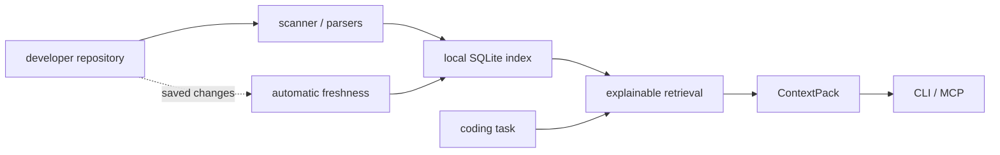

# RepoMind

Local-first repository intelligence for developers and AI coding agents.

Index once. Understand everywhere.

RepoMind builds a persistent local index of a codebase, keeps it fresh as files change, and returns task-aware context that coding agents can use for focused discovery. It is not a coding agent, hosted service, embedding store, or replacement for reading source files. It helps agents find the right files, relationships, facts, and risks before they edit.

Key capabilities:

- Automatic freshness
- Task-aware ContextPack
- Explainable retrieval
- Repository memory
- Caller, dependency, and impact analysis
- Bounded, change-aware test-impact analysis
- MCP support
- No cloud upload required

RepoMind runs locally. It does not execute repository source, upload code, call external AI APIs, or send telemetry.

## What RepoMind Is

RepoMind is a portable repository intelligence layer for developers and AI coding agents. It indexes files, symbols, imports, routes, dependency edges, architecture facts, Git working-tree state, and evidence-backed repository memory into a local SQLite index under `.repomind/`.

Agents can query RepoMind through the CLI or MCP to get a compact ContextPack for a task, inspect dependency and caller relationships, retrieve bounded snippets, and reuse durable repository facts with provenance.

RepoMind output is guidance for discovery. The working tree remains authoritative, and agents should inspect actual source before making edits.

## Why RepoMind

Large repositories make agents spend time rediscovering the same structure: where tests live, which files define routes, what symbols call each other, whether saved changes made the index stale, and which files are likely relevant to a task.

RepoMind focuses on reusable, local, deterministic signals:

- changed files are detected by hash;
- unchanged files are not reparsed during normal refresh;
- context is ranked for a specific task;
- ranking can explain why files were selected;
- repository memory is tied to evidence paths and staleness state;
- token and context metrics are reported as local estimates, not billing claims.

## Installation

Python 3.11 or newer is required.

Install a wheel downloaded from the project's
[GitHub Releases](https://github.com/raazlehra/Repomind/releases) page in an isolated environment:

```powershell
python -m venv .venv
.\.venv\Scripts\Activate.ps1
python -m pip install "C:\Downloads\repomind-<version>-py3-none-any.whl"
repomind --version
repomind --help
```

Do **not** use plain `pip install repomind`: that name on PyPI currently resolves to a
different project. The current RepoMind beta is `v2.0.0b10`; install its wheel from the
project's GitHub Releases page.

For contributors working from a trusted checkout:

```powershell
python -m pip install -e ".[dev]"
```

The base package includes the local MCP server dependency. The local wheel can be installed
with `[watch]` or `[treesitter]` extras; this keeps package resolution tied to the downloaded
artifact instead of the unrelated PyPI project. Without `watchdog`, `repomind watch` is
unavailable, but retrieval-time freshness checks still work. Without compatible Tree-sitter
grammars, built-in deterministic JavaScript and TypeScript parsers remain active.

See [Installation and lifecycle](docs/INSTALLATION.md) for the verified Windows flow,
optional-extra syntax, local builds, beta-9 upgrade behavior, and uninstall/reinstall details.

## Quick Start

```bash
cd existing-repository
repomind init
repomind status
repomind context "fix authentication refresh token bug"
repomind context "fix authentication refresh token bug" --explain --format markdown
repomind memory list
repomind map --depth 3 --symbols
```

Useful follow-up queries:

```bash
repomind stats
repomind symbol AuthService.login --format json
repomind callers AuthService.login
repomind dependencies backend/auth.py
repomind impact AuthService.login
repomind snippets AuthService.login
```

Manual memory can be added when a human knows an important repository convention:

```bash
repomind memory add --category architecture --source backend/services/payments.py "All payment state transitions go through PaymentService."
repomind memory validate
repomind memory stale
```

All commands above exist in the current CLI. Most read commands accept `--format text`, `--format markdown`, or `--format json`. Use `-C PATH` or `--repository PATH` from outside a repository.

## How It Works

RepoMind separates static repository discovery from task-time retrieval:



For a fuller public-facing architecture diagram, see [docs/HOW_IT_WORKS.md](docs/HOW_IT_WORKS.md).

The scanner honors `.gitignore`, `.repomindignore`, and optional `.repomind.toml` settings. It excludes generated directories, binaries, oversized files, environment files, keys, and obvious credential paths by default.

The index stores metadata and relationships, not whole source files or whole ASTs. Level 3 context and `snippets` read bounded source directly from the working tree when requested.

Common CLI commands:

| Command | Purpose |
|---|---|
| `repomind init [path]` | Create and populate an index |
| `repomind refresh` | Hash and reparse created or modified files; remove deleted files |
| `repomind status` | Show index, working-tree, freshness, and memory counts |
| `repomind stats` | Show repository intelligence metrics |
| `repomind context "task"` | Retrieve task-specific context |
| `repomind memory add/list/show/remove/validate/stale` | Manage local repository memory |
| `repomind map` | Print a compact repository map |
| `repomind symbol SYMBOL` | Show symbol signatures and locations |
| `repomind callers SYMBOL` | Show statically detected callers |
| `repomind dependencies TARGET` | Show outgoing file or symbol dependencies |
| `repomind impact TARGET` | Estimate direct, indirect, test, route, and UI impact |
| `repomind test-impact [FILES...]` | Build a bounded, evidence-backed test plan for changes |
| `repomind snippets SYMBOL` | Read bounded working-tree snippets |
| `repomind audit [path]` | Generate a deterministic repository audit |
| `repomind watch` | Debounce filesystem changes and refresh proactively |
| `repomind doctor` | Run actionable diagnostics |
| `repomind install-codex [path]` | Install the Codex skill and `AGENTS.md` guidance |
| `repomind mcp` | Run the local MCP server |

Optional `.repomind.toml`:

```toml
[repomind]
exclude = ["examples/legacy/**"]
include = ["docs/architecture.custom"]
context_budget = 2000
watch = false
languages = ["python", "typescript", "tsx"]
max_file_size = 1000000
generated_directories = [".git", ".repomind", "node_modules", "dist", "build", "target"]
secret_patterns = [".env", ".env.*", "*.pem", "*.key", "credentials*", "secrets*"]
```

`generated_directories` and `secret_patterns` replace their defaults when configured, so keep entries you still want excluded. `.git` and `.repomind` remain hard exclusions.

## Change-Aware Test Impact

Analyze dirty working-tree changes, explicit repository-relative files, or a Git base:

```bash
repomind test-impact -C . --format markdown
repomind test-impact app/services.py frontend/src/api.ts -C . --format json
repomind test-impact -C . --base main --format json
```

The report separates discovery, static relationship evidence, recommended command data,
and unknown coverage. It classifies each JavaScript/TypeScript test independently and groups
recommendations by nearest owning `package.json`, framework, and script.
Python targets are grouped by their nearest project/test configuration boundary; support
files such as `conftest.py`, fixtures, factories, helpers, and servers are indexed as
dependency evidence but are not emitted as direct pytest targets.

Analysis is bounded by configurable graph, impacted-area, test, command, evidence, and
output limits. Every bounded collection reports totals, returned counts, its applicable
limit, and whether it was truncated. JSON uses the stable
`repomind.test-impact.v1` schema and repository-relative paths by default.

Test-impact is strictly analysis-only. The CLI and MCP return recommended command strings,
argument arrays, and repository-relative working directories as data; RepoMind never runs
those commands or repository test code. Codex, CI, or a developer must separately review,
approve, and execute recommendations in an appropriately trusted environment.

See the [sanitized sample test-impact report](docs/SAMPLE_TEST_IMPACT_REPORT.md) for a
reproducible synthetic example and guidance on interpreting evidence and limits.

## Automatic Freshness

RepoMind read commands check saved working-tree changes before reading the index:

```text
save source -> retrieval request -> freshness check -> incremental refresh if needed -> current context
```

This applies to `context`, `map`, `symbol`, `callers`, `dependencies`, `impact`, `test-impact`, `snippets`, and MCP/service equivalents. Saved changes can be reflected without a Git commit, manual refresh, watch mode, or RepoMind restart.

Watch mode is optional and proactive. It is useful when you want the index updated soon after filesystem events, but retrieval correctness does not depend on it.

If a changed file has a parser error, unaffected files remain usable. The structured freshness payload reports `partial`, and CLI read commands warn rather than presenting stale symbols from the broken file as current.

## ContextPack

`repomind context` returns a task-aware ContextPack. It includes deterministic intent labels, architecture facts, relevant repository memory, ranked files, primary and related file groups, tests, symbols, relationships, routes, likely modification areas, budget state, freshness state, and provider-neutral metrics.

```bash
repomind context "fix login bug" --budget 1000
repomind context "fix login bug" --mode minimal
repomind context "fix login bug" --mode balanced
repomind context "fix login bug" --mode deep
repomind context "fix login bug" --level 2 --format json
```

Context modes are approximate presets:

- `minimal`: about 750 estimated tokens
- `balanced`: about 2000 estimated tokens
- `deep`: about 5000 estimated tokens

Context levels:

- Level 1: architecture, memory, ranked files, symbols, relationships, likely modification area
- Level 2: Level 1 plus signatures, imports, and nearby dependency details
- Level 3: Level 2 plus selected bounded source snippets

Token counts are local character-based estimates. They are not provider tokenizer counts or billing-token values.

## Repository Memory

Repository Memory stores durable local facts about a repository. It is evidence-backed, freshness-aware, and agent-neutral. It is not generic chat memory, embeddings, generated architecture prose, a secret store, or a hosted profile.

Automatic memory is conservative. RepoMind persists facts only when they come from deterministic indexed evidence such as manifests, configuration, route/test layout, architecture facts with file evidence, and strong source markers. Automatic records store source paths, optional source symbols, an evidence hash, category, confidence, timestamps, source type, and status.

Manual memory is explicit and marked `manual`:

```bash
repomind memory add --category architecture --source backend/services/payments.py "All payment state transitions go through PaymentService."
repomind memory list --category architecture --format json
repomind memory show <key-or-id>
repomind memory remove <key-or-id>
repomind memory validate
repomind memory stale
```

Automatic memory can move through freshness states:

```text
same evidence hash -> valid
changed evidence hash -> needs_validation
missing deterministic fact or evidence -> stale
manual memory -> manual
```

Normal task retrieval includes only relevant `valid` and `manual` memory by default. Stale and uncertain automatic memory is not surfaced as valid context.

## Explainable Retrieval

Use `--explain` when you need ranking diagnostics:

```bash
repomind context "fix refresh token" --explain --format markdown
repomind context "fix refresh token" --explain --format json
```

Explanations can include path, symbol, lexical, graph, route, dependency, test, task-intent, Git freshness, and bounded memory signals. Memory influence is intentionally capped below exact source, path, symbol, route, and graph evidence.

Budget fitting removes lower-priority records first instead of blindly truncating rendered text.

## Dependency / Impact Analysis

RepoMind stores conservative static relationships for imports, calls, inheritance, routes, and test targets. Relationship confidence is stored with evidence so unresolved or uncertain references do not become invented edges.

```bash
repomind callers AuthService.login
repomind dependencies backend/auth.py
repomind impact AuthService.login
repomind snippets AuthService.login
```

Static analysis is intentionally conservative. Dynamic dispatch, reflection, runtime-generated imports, dependency injection, and framework magic may require normal source inspection.

## Supported Languages

First-class extraction:

- Python: AST-backed classes, functions, methods, decorators, signatures, constants, imports, calls, inheritance, and common decorator routes.
- JavaScript, TypeScript, JSX, TSX: imports, exported declarations, functions, classes, interfaces, types, enums, arrow functions/components, inheritance/implementation, lexical calls, and common router calls. With the `treesitter` extra, Tree-sitter supplies declaration spans while deterministic extraction retains relationship evidence.

Conservative fallback extraction:

- Java, Go, Rust, C#, C, and C++

Additional basic file recognition:

- Ruby, PHP, Swift, Kotlin, Scala, shell, SQL, common manifests, configuration files, and documentation files.

## Codex Integration

This repository includes `.codex/skills/repomind/SKILL.md`. Install integration into another project with:

```bash
cd project
repomind install-codex
```

This creates the project-local skill and creates or appends a delimited RepoMind section to `AGENTS.md`. Existing content is preserved, and repeated runs are idempotent.

The skill instructs Codex to query RepoMind before broad scanning, use results for file discovery, inspect source before edits, and request deeper detail only when needed.

## MCP Integration

RepoMind can run as a local MCP server for coding agents:

```powershell
& "C:\path\to\repomind-venv\Scripts\python.exe" -m repomind mcp
```

The MCP server uses stdio transport and exposes status, context, stats, memory, symbol, callers, dependencies, impact, bounded test impact, snippets, refresh, and map tools.

Typical MCP flow:

1. Call `repomind_status`.
2. Call `repomind_context` with `level=1` for the task.
3. Inspect actual source before editing.
4. Use `repomind_memory`, `repomind_symbol`, `repomind_dependencies`, `repomind_callers`, `repomind_impact`, `repomind_test_impact`, or `repomind_snippets` when deeper detail is useful.

See [docs/MCP.md](docs/MCP.md) for verified Codex setup, current Copilot CLI and VS Code
configuration guidance, optional Claude Code guidance, and validation boundaries.

## Stats / Metrics

`repomind stats` reports local repository intelligence metrics:

```bash
repomind stats --format json
```

Metrics include indexed files, symbols, routes, relationships, memory counts, represented text bytes, estimated repository tokens, token-estimation method, last refresh, and freshness reuse counts.

Context metrics include candidate files considered, files returned, rendered context bytes, estimated context tokens, requested budget, truncation state, retrieval latency, and file/context-volume reduction percentages. These are local estimates for observability and comparison, not provider billing claims.

## Benchmarks

Run deterministic fixture benchmarks:

```bash
python -m benchmarks.run_benchmark --format markdown
python -m benchmarks.run_benchmark --format json --output benchmark.json
```

The benchmark harness measures indexing duration, incremental reuse, memory validation timing, selected files, output bytes, approximate tokens, retrieval latency, index size, and expected-file recall on small synthetic fixtures. See [BENCHMARKS.md](BENCHMARKS.md).

Current beta.8 validation reported 12/12 expected benchmark files retrieved with mean expected-file recall of 1.000. Benchmark results are fixture measurements, not universal performance or savings claims.

## Privacy / Security

RepoMind is local-first by default:

- no repository source execution by test-impact; it returns command recommendations as data only;
- no network requests for normal indexing or retrieval;
- no cloud uploads;
- no telemetry;
- no external AI APIs.

The SQLite index may contain repository paths, symbol names, signatures, short docstrings, dependency evidence, architecture facts, Git state, and repository memory metadata. Treat `.repomind/` as local repository metadata and do not normally commit it.

Repository Memory follows the same privacy model. Automatic memory rejects facts without evidence and stores paths, optional symbols, and hashes rather than large source payloads or secret values. Manual memory source paths are checked for secret-like names.

See [SECURITY.md](SECURITY.md).

## Limitations

- RepoMind is not a coding agent and does not edit code.
- Static analysis can miss dynamic language behavior, reflection, runtime-generated imports, dependency injection, and framework magic.
- Test-impact recommendations are evidence-based suggestions and are not guaranteed to find every relevant test or risk.
- Confidence labels are heuristic summaries of available static evidence, not calibrated probabilities.
- Truncated collections and lower-bound counts must be interpreted using the report's completeness and truncation metadata.
- RepoMind does not provide security certification or replace a dedicated security review.
- Agent-generated conclusions based on RepoMind output still require developer review.
- JavaScript and TypeScript extraction is deterministic structural extraction, not a full compiler frontend.
- Fallback-language extraction is intentionally shallow.
- Architecture detection reports manifest/config evidence and can be incomplete.
- Repository Memory is conservative and may omit useful facts unless they can be tied to strong indexed evidence or added manually.
- Automatic memory can require validation after evidence changes.
- Approximate token counts are not provider tokenizer or billing values.
- RepoMind does not guarantee AI credit savings, token savings, or performance outcomes across arbitrary repositories.
- `.repomind/` indexes are local caches and should not normally be committed.

## License

RepoMind is licensed under the [Apache License 2.0](LICENSE).

## Roadmap

Planned work is tracked in [IMPLEMENTATION_PLAN.md](IMPLEMENTATION_PLAN.md). Near-term areas include broader parser coverage, richer deterministic architecture detection, additional MCP ergonomics, more benchmark fixtures, and continued hardening of repository memory validation.

The roadmap does not require embeddings, external LLM calls, cloud APIs, vector databases, hosted services, UI, accounts, or telemetry.

## Contributing / Beta Testing

RepoMind is in beta. Useful feedback includes:

- repositories where retrieval selects confusing files;
- missing static relationships or language constructs;
- memory facts that should be detected but are not;
- stale documentation or unclear CLI behavior;
- benchmark cases that represent real maintenance tasks.

For development:

```bash
python -m pytest
python -m ruff check .
python -m mypy repomind
python -m build
```

See [ARCHITECTURE.md](ARCHITECTURE.md), [CONTRIBUTING.md](CONTRIBUTING.md), and [SECURITY.md](SECURITY.md).
