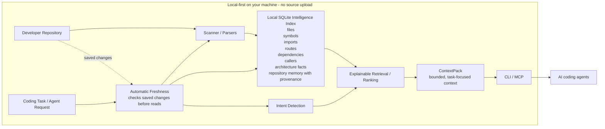

# How RepoMind Works

RepoMind is local-first repository intelligence for coding agents. It scans a developer repository on your machine, builds a local SQLite index, keeps that index fresh when saved files change, and returns a task-focused ContextPack through the CLI or MCP.

## Reading The Diagram

- `repomind init` scans the repository and writes a local `.repomind/index.sqlite3` cache.
- Scanner and parser output is stored as compact repository intelligence: paths, symbols, imports, routes, dependency/caller relationships, architecture facts, and evidence-backed memory.
- Read commands check freshness before answering, so saved source changes can be reflected without running `refresh` or `watch`.
- A task request goes through intent detection and explainable ranking, then returns a bounded ContextPack through the CLI or MCP.
- RepoMind does not require cloud indexing, embeddings, telemetry, or source upload.
